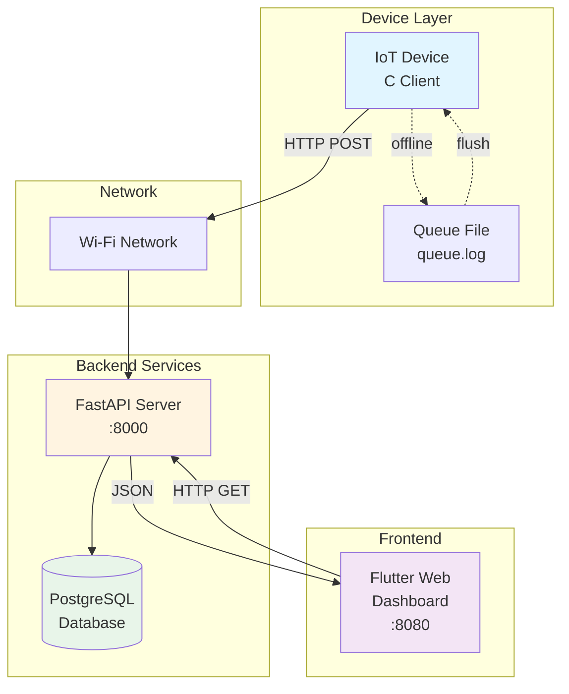
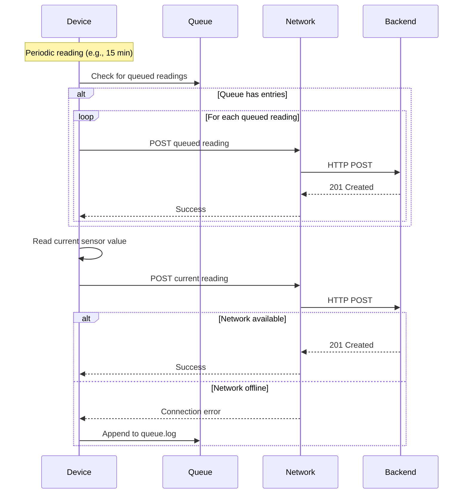
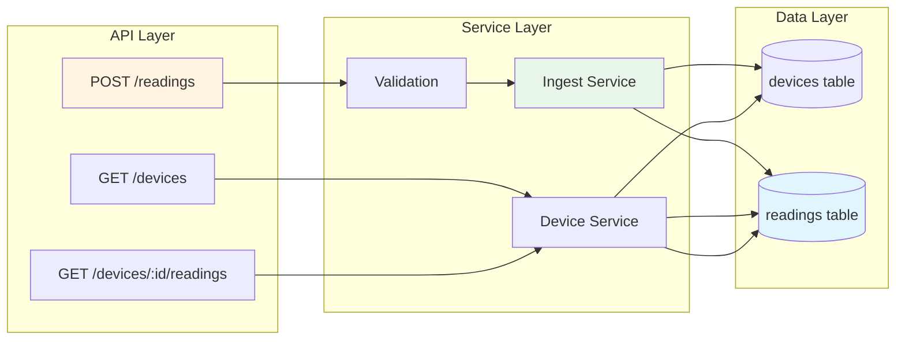
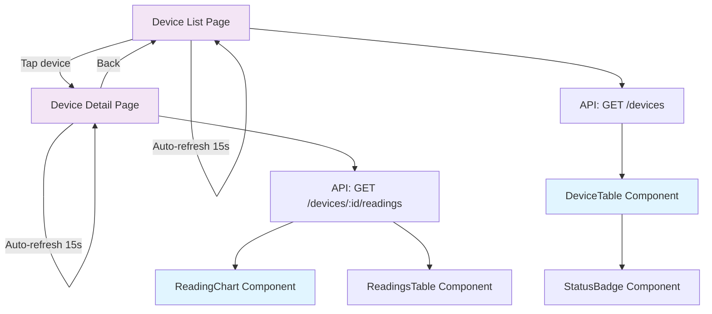
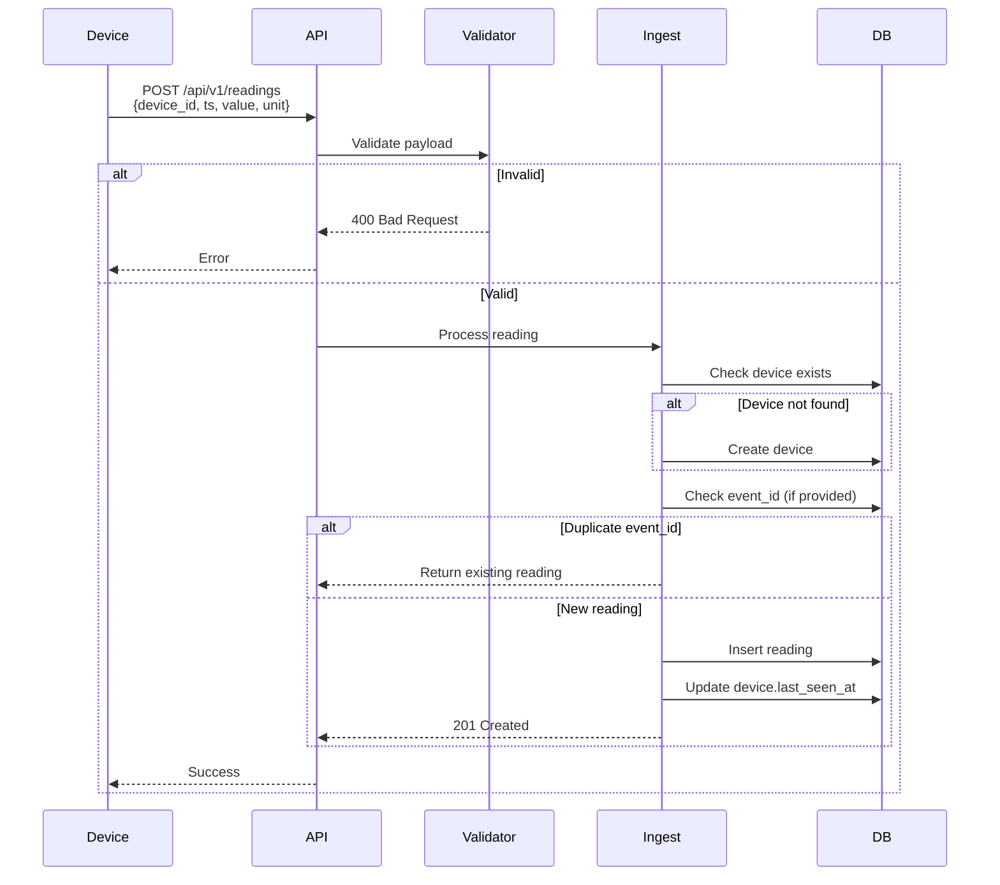
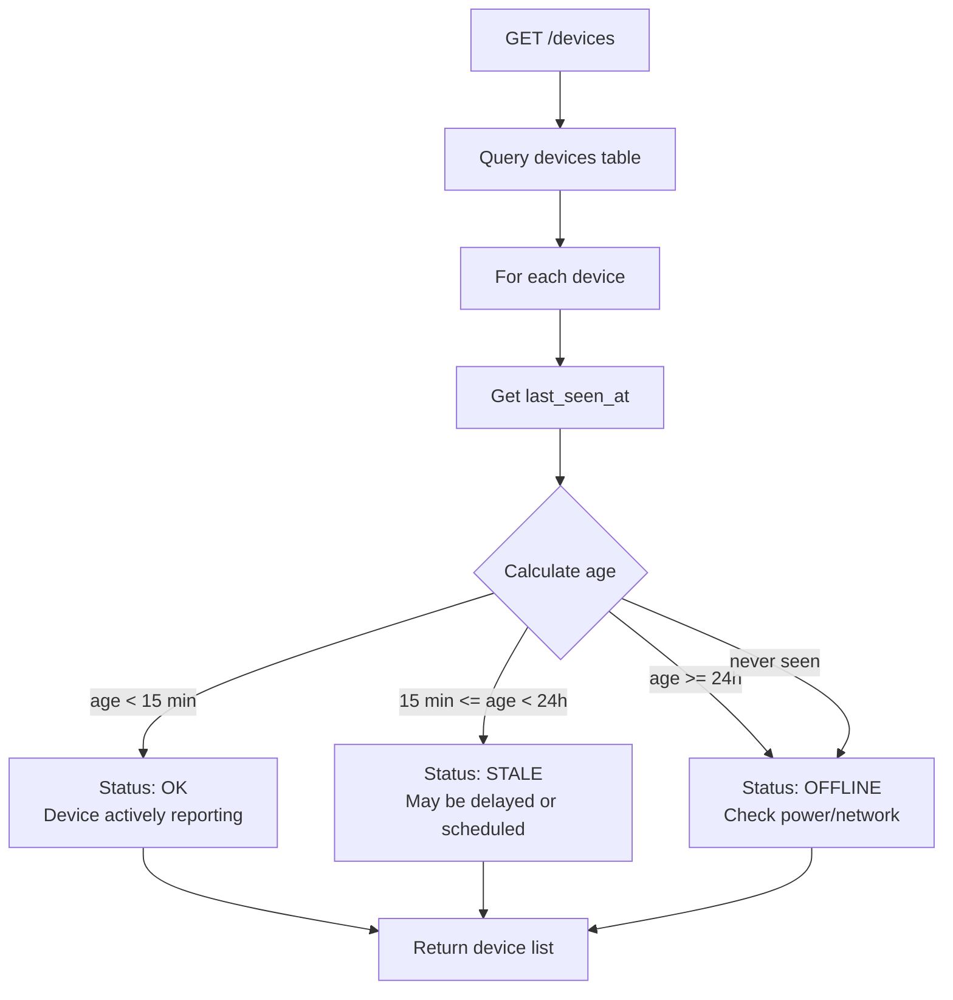
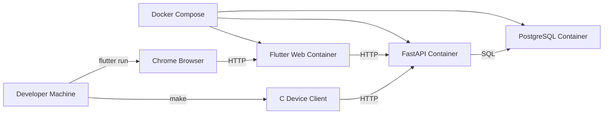
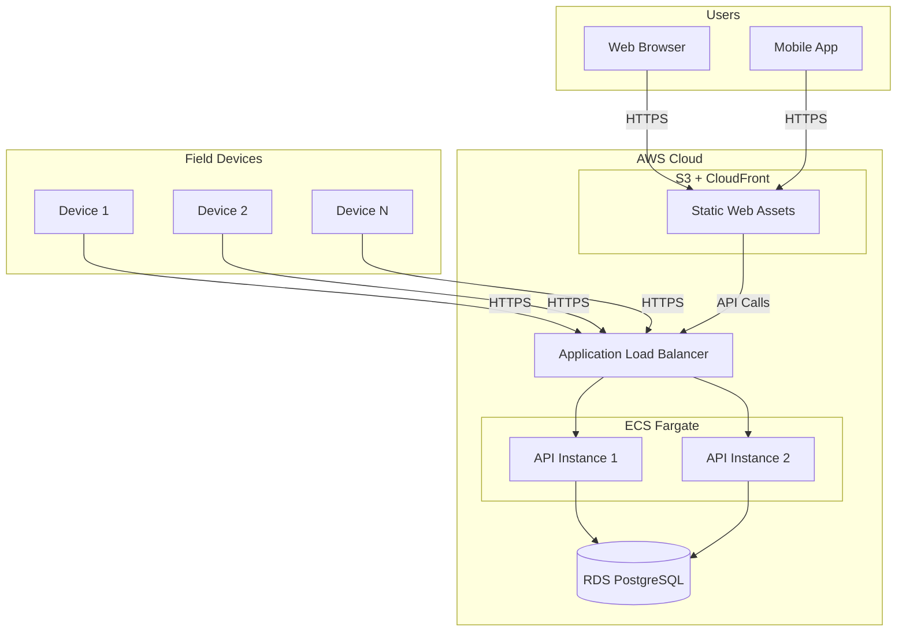

# Architecture Documentation

## System Overview

The Refractometry IoT MVP demonstrates a production-ready telemetry architecture optimized for reliability and unattended operation.

## Component Architecture

### Device Layer (C Client)

**Purpose**: Reference connectivity client demonstrating IoT device communication patterns.

**Responsibilities**:
- Read sensor values (simulated in prototype)
- Generate Refractive Index (RI) readings (range: 1.3300-1.3400)
- POST readings to backend via HTTP
- Queue readings when offline
- Flush queued readings on reconnect

**Note**: The simulator generates RI values only. Brix is supported by the API for compatibility but is not generated by the simulator, as refractometers measure RI directly.

**Key Files**:
- `main.c` - Orchestration and CLI
- `http_client.c` - HTTP POST using libcurl
- `queue.c` - File-based queue management

### Backend API (FastAPI + PostgreSQL)

**Purpose**: Centralized telemetry ingestion, validation, and storage.

**Responsibilities**:
- Validate incoming readings
- Enforce idempotency via event_id
- Store readings in time-series database
- Update device last_seen_at timestamps
- Provide query endpoints for dashboard

**Key Endpoints**:
- `POST /api/v1/readings` - Ingest reading
- `GET /api/v1/devices` - List devices with status, target RI, and alert boundaries
- `GET /api/v1/devices/{id}/readings` - Reading history

**Device Configuration**:
- `target_ri` - Target Refractive Index value for process control
- `alert_low` - Lower alert boundary (warrants investigation if below)
- `alert_high` - Upper alert boundary (warrants investigation if above)

### Web Dashboard (Flutter Web)

**Purpose**: Real-time device monitoring and visualization.

**Responsibilities**:
- Display device list with status badges (OK/STALE/OFFLINE)
- Show device detail pages with time-series charts
- Display target RI and alert boundaries with visual indicators
- Auto-refresh device status every 15 seconds
- Color-code readings based on target/alert boundaries
- Handle offline/error states gracefully

**Key Pages**:
- Device List (`/`) - Table of all devices with status badges
- Device Detail (`/devices/:id`) - Chart, reading history, target RI, and alert boundaries

**Features**:
- Auto-refresh every 15 seconds on both list and detail pages
- Target RI and alert boundaries (low/high) with visual indicators
- Color-coded readings (green=at target, red=outside alerts, blue=normal)
- Device status: OK (seen <15min), STALE (15min-24h), OFFLINE (>24h)

## Data Flow

### Reading Ingestion Flow

### Device Status Calculation

## Design Decisions

### Wi-Fi over BLE

**Rationale**: 
- BLE is excellent for commissioning and local service workflows
- Wi-Fi/cloud is better for unattended periodic telemetry
- BLE can be fragile in production (range, OS background limits, permissions, OEM quirks)

**Trade-offs**:
- ✅ Reliable unattended operation
- ✅ No phone dependency
- ✅ Better for fleet management
- ❌ Requires Wi-Fi infrastructure
- ❌ Higher power consumption than BLE

### Store-and-Forward Queue

**Rationale**: Devices must continue operating during network outages.

**Implementation**:
- Simple file-based queue (`queue.log` in JSONL format)
- Flush on reconnect before sending current reading
- No size limits in prototype (add rotation in production)

**Trade-offs**:
- ✅ Simple, no dependencies
- ✅ Works on any filesystem
- ❌ Not suitable for high-volume production
- ❌ No transaction guarantees

### FastAPI Backend

**Rationale**: Fast development, automatic OpenAPI docs, async support.

**Trade-offs**:
- ✅ Rapid prototyping
- ✅ Type safety with Pydantic
- ✅ Auto-generated API docs
- ❌ Python runtime overhead (acceptable for API)

### Flutter Web Frontend

**Rationale**: Single codebase for web and future native mobile apps.

**Trade-offs**:
- ✅ Code reuse for native apps
- ✅ Modern UI framework
- ✅ Good performance for dashboards
- ❌ Larger bundle size than vanilla JS
- ❌ Web support is newer (but stable)

## Deployment Architecture

### Local Development

### Production (Future)

## Security Considerations

### Current (Prototype)
- HTTP (not HTTPS) for device communication
- No authentication/authorization
- No rate limiting

### Production Requirements
- TLS/HTTPS for all device communication
- API key or certificate-based device authentication
- Rate limiting per device
- Input validation (already implemented)
- SQL injection protection (SQLAlchemy ORM provides this)

## Scalability Considerations

### Current Limitations
- Single PostgreSQL instance
- No horizontal scaling for API
- File-based queue on device (not scalable for high volume)

### Production Scaling Path
- **Database**: Read replicas, connection pooling, partitioning by device_id
- **API**: Horizontal scaling with load balancer, stateless design
- **Queue**: Move to cloud message queue (SQS, RabbitMQ) or device-side SQLite
- **Caching**: Redis for device status, reduce DB load

## Monitoring and Observability

### Recommended Metrics
- Device uptime (last_seen_at tracking)
- Reading ingestion rate
- Queue depth per device
- API latency (p50, p95, p99)
- Error rates by endpoint

### Logging
- Structured JSON logs
- Device ID in all log entries
- Request/response logging for debugging

## Future Enhancements

1. **Native Mobile Apps**: Flutter native bridges for Android/iOS
2. **BLE Commissioning**: Secondary path for device setup
3. **OTA Updates**: Device firmware update mechanism
4. **Alerting**: Threshold-based alerts for readings
5. **Analytics**: Aggregated statistics and trends
6. **Multi-tenancy**: Support for multiple organizations
