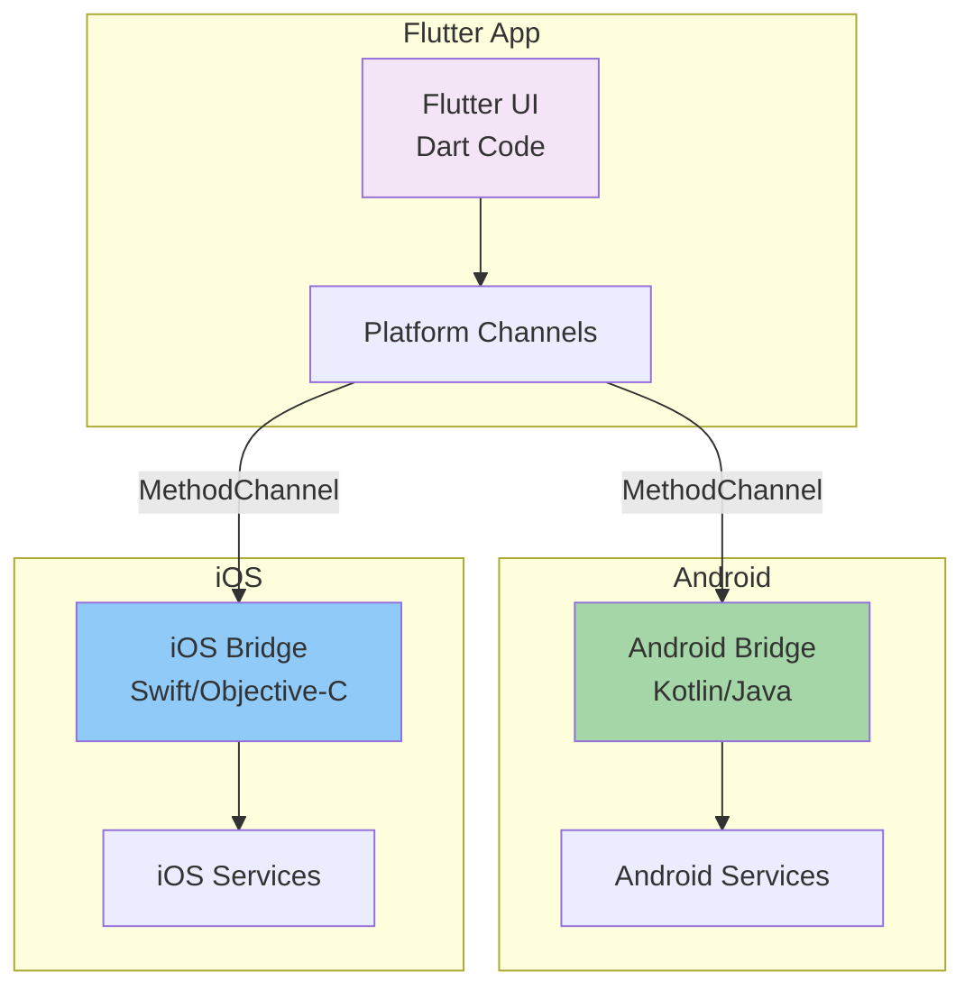

# Flutter Native Bridges Documentation

## Overview

The Flutter web dashboard can be extended to native Android and iOS applications using Flutter's platform channel system. This document outlines the architecture for native bridge implementation.

## Architecture



## Use Cases for Native Bridges

### 1. BLE Commissioning (Future)

For local device setup and commissioning workflows:

```dart
// Flutter side
import 'package:flutter/services.dart';

class BLEBridge {
  static const platform = MethodChannel('com.refract.iot/ble');
  
  Future<List<BLEDevice>> scanForDevices() async {
    try {
      final result = await platform.invokeMethod('scanDevices');
      return parseBLEDevices(result);
    } on PlatformException catch (e) {
      print("Failed to scan: ${e.message}");
      return [];
    }
  }
  
  Future<bool> connectToDevice(String deviceId) async {
    try {
      final result = await platform.invokeMethod('connect', {'deviceId': deviceId});
      return result as bool;
    } on PlatformException catch (e) {
      return false;
    }
  }
}
```

**Android Implementation** (Kotlin):
```kotlin
// MainActivity.kt
class MainActivity: FlutterActivity() {
    private val CHANNEL = "com.refract.iot/ble"
    
    override fun configureFlutterEngine(flutterEngine: FlutterEngine) {
        super.configureFlutterEngine(flutterEngine)
        
        MethodChannel(flutterEngine.dartExecutor.binaryMessenger, CHANNEL).setMethodCallHandler { call, result ->
            when (call.method) {
                "scanDevices" -> {
                    // Use Android BLE API
                    val devices = scanBLEDevices()
                    result.success(devices)
                }
                "connect" -> {
                    val deviceId = call.argument<String>("deviceId")
                    val connected = connectToBLEDevice(deviceId)
                    result.success(connected)
                }
                else -> result.notImplemented()
            }
        }
    }
}
```

**iOS Implementation** (Swift):
```swift
// AppDelegate.swift
import Flutter
import CoreBluetooth

@UIApplicationMain
@objc class AppDelegate: FlutterAppDelegate {
    override func application(
        _ application: UIApplication,
        didFinishLaunchingWithOptions launchOptions: [UIApplication.LaunchOptionsKey: Any]?
    ) -> Bool {
        let controller = window?.rootViewController as! FlutterViewController
        let channel = FlutterMethodChannel(
            name: "com.refract.iot/ble",
            binaryMessenger: controller.binaryMessenger
        )
        
        channel.setMethodCallHandler { (call: FlutterMethodCall, result: @escaping FlutterResult) in
            switch call.method {
            case "scanDevices":
                // Use iOS CoreBluetooth
                let devices = scanBLEDevices()
                result(devices)
            case "connect":
                let args = call.arguments as! [String: Any]
                let deviceId = args["deviceId"] as! String
                let connected = connectToBLEDevice(deviceId)
                result(connected)
            default:
                result(FlutterMethodNotImplemented)
            }
        }
        
        return super.application(application, didFinishLaunchingWithOptions: launchOptions)
    }
}
```

### 2. Push Notifications

For device alerts and status updates:

```dart
// Flutter side
class NotificationBridge {
  static const platform = MethodChannel('com.refract.iot/notifications');
  
  Future<void> requestPermissions() async {
    await platform.invokeMethod('requestPermissions');
  }
  
  Future<void> showAlert(String deviceId, String message) async {
    await platform.invokeMethod('showAlert', {
      'deviceId': deviceId,
      'message': message,
    });
  }
}
```

### 3. Background Tasks

For periodic status checks when app is in background:

```dart
// Flutter side
class BackgroundTaskBridge {
  static const platform = MethodChannel('com.refract.iot/background');
  
  Future<void> schedulePeriodicCheck(int intervalMinutes) async {
    await platform.invokeMethod('scheduleTask', {
      'interval': intervalMinutes,
    });
  }
}
```

## Implementation Guidelines

### Method Channel Naming Convention

Use reverse domain notation:
- `com.refract.iot/ble` - BLE operations
- `com.refract.iot/notifications` - Push notifications
- `com.refract.iot/background` - Background tasks

### Error Handling

Always handle `PlatformException` in Dart:

```dart
try {
  final result = await platform.invokeMethod('someMethod');
} on PlatformException catch (e) {
  // Handle platform-specific errors
  print("Platform error: ${e.code} - ${e.message}");
} catch (e) {
  // Handle other errors
  print("Error: $e");
}
```

### Type Safety

Use strongly-typed arguments and return values:

```dart
// Good: Type-safe
final deviceId = call.argument<String>("deviceId");
final value = call.argument<double>("value");

// Avoid: Dynamic types
final args = call.arguments as Map<String, dynamic>;
```

## Testing Native Bridges

### Unit Tests

Test platform channel communication:

```dart
// test/native_bridge_test.dart
void main() {
  TestWidgetsFlutterBinding.ensureInitialized();
  
  test('BLE scan returns devices', () async {
    const channel = MethodChannel('com.refract.iot/ble');
    
    channel.setMockMethodCallHandler((call) async {
      if (call.method == 'scanDevices') {
        return [
          {'id': 'DEV001', 'name': 'Device 1'},
        ];
      }
      return null;
    });
    
    final bridge = BLEBridge();
    final devices = await bridge.scanForDevices();
    expect(devices.length, 1);
  });
}
```

### Integration Tests

Test on real devices or emulators:

```dart
// integration_test/native_bridge_test.dart
void main() {
  IntegrationTestWidgetsFlutterBinding.ensureInitialized();
  
  testWidgets('BLE connection flow', (tester) async {
    // Test full flow with real platform channels
  });
}
```

## Platform-Specific Considerations

### Android

**Permissions** (AndroidManifest.xml):
```xml
<uses-permission android:name="android.permission.BLUETOOTH" />
<uses-permission android:name="android.permission.BLUETOOTH_ADMIN" />
<uses-permission android:name="android.permission.BLUETOOTH_SCAN" />
<uses-permission android:name="android.permission.BLUETOOTH_CONNECT" />
<uses-feature android:name="android.hardware.bluetooth_le" android:required="true" />
```

**Minimum SDK**: API 21 (Android 5.0) for BLE support

### iOS

**Info.plist**:
```xml
<key>NSBluetoothAlwaysUsageDescription</key>
<string>This app needs Bluetooth to connect to refractometry devices</string>
<key>UIBackgroundModes</key>
<array>
    <string>bluetooth-central</string>
</array>
```

**Minimum iOS**: 13.0 for modern BLE APIs

## Current Status

**Web Version**: Fully implemented (no native bridges needed)

**Native Apps**: Planned for future development
- Android: Kotlin bridge implementation
- iOS: Swift bridge implementation

## References

- [Flutter Platform Channels](https://docs.flutter.dev/development/platform-integration/platform-channels)
- [Android BLE Guide](https://developer.android.com/guide/topics/connectivity/bluetooth/ble-overview)
- [iOS CoreBluetooth](https://developer.apple.com/documentation/corebluetooth)
